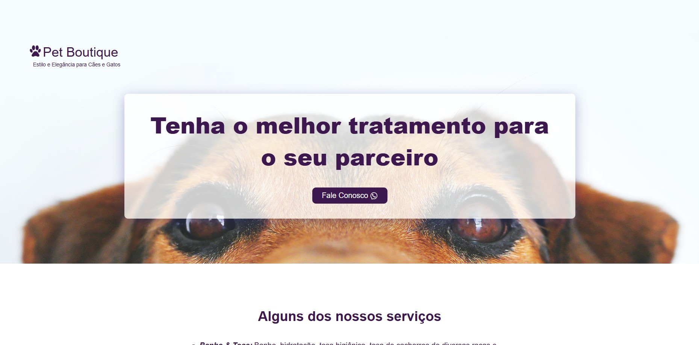

# 🐾 Boutique Pet

Projeto desenvolvido durante meus estudos de **Desenvolvimento Web**, com o objetivo de praticar a criação de uma página para um pet shop, aplicando conceitos de **HTML5 e CSS3**.

O projeto simula o site de uma loja especializada em produtos e serviços para animais de estimação, com uma interface simples, organizada e responsiva.

---

## 📌 Sobre o projeto

O **Boutique Pet** foi desenvolvido como um projeto de aprendizado para colocar em prática os conhecimentos adquiridos durante meus estudos de desenvolvimento web.

A proposta foi criar uma página visualmente agradável e funcional para um pet shop, trabalhando principalmente a estruturação do conteúdo, organização dos elementos e estilização da interface.

---

## 🚀 Tecnologias utilizadas

- HTML5
- CSS3

---

## 💻 Funcionalidades

- Página inicial com apresentação do pet shop
- Seção de marcas
- Apresentação de serviços
- Seção de redes sociais
- Navegação entre as seções da página

---

## 📚 O que aprendi

Durante o desenvolvimento deste projeto, pude praticar:

- Estruturação de páginas utilizando **HTML semântico**
- Organização de conteúdo utilizando diferentes elementos HTML
- Estilização de páginas utilizando **CSS**
- Utilização de **Flexbox**
- Trabalho com imagens e elementos visuais
- Organização de arquivos e pastas de um projeto web

---

## 🌐 Acesse o projeto

<a href="https://boutique-pet-orpin.vercel.app" target="_blank">Acesse o site</a>

---

## 📷 Preview

  

---

## 👨‍💻 Desenvolvido por

**Bruno Barros**

Desenvolvido como parte dos meus estudos em **Desenvolvimento Web**.